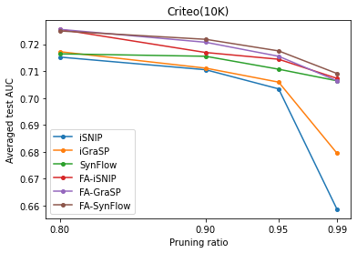
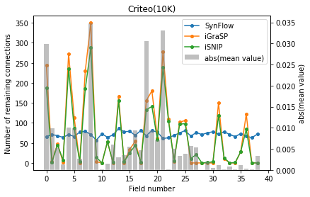
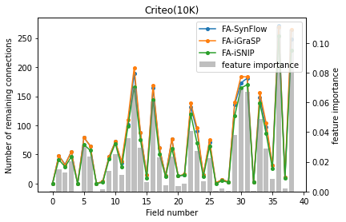

# prdnn
pruning neural network for tabular data classification

## Installation
We test the code with python 3.7.3 and pip-installed TensorFlow 2.4.1.
```bash
pip install tensorflow==2.4.1
pip install numpy==1.19.2
pip install -U scikit-learn
pip install matplotlib
pip install pyyaml
```
## Reproduce 
We need run different pruning methods and save the AUC and remaining connections after pruning into cache file.
```bash
> cd src
> bash ./run.sh > run.log
```
The above command takes about 6 minutes on our computer with one GTX 1080ti, and it will write the AUC and remaining connections to *'../plots/cache'* directory. The results contains the commbinations of pruning ratios={0.8, 0.9, 0.95, 0.99} and pruning methods={iSNIP, iGraSP, SynFlow, FA-iSNIP, FA-iGraSP, FA-SynFlow}.

## Draw figures
After that, we can go to *plots* directory and draw the figures. We provide jupyter notebooks to reproduce the main phenomenon of the paper with results, including:
- plots/draw_remaining_connections.ipynb
- plots/plot_auc.ipynb

The results of AUC are shown in 'plots/plot_auc.ipynb' (correspoinding to Fig. 3 & 8), while the remaining connections are shown in 'plots/draw_remaining_connections.ipynb' (correspoinding to Fig. 4 & 12).

Below are the figures generated by the jupyter notebooks.






